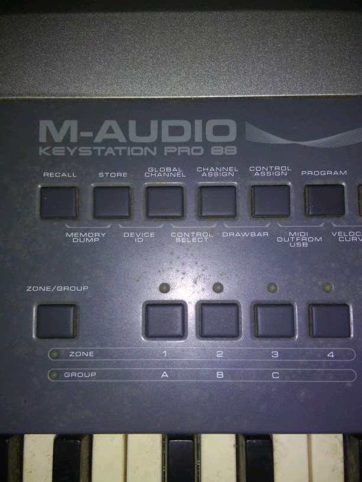
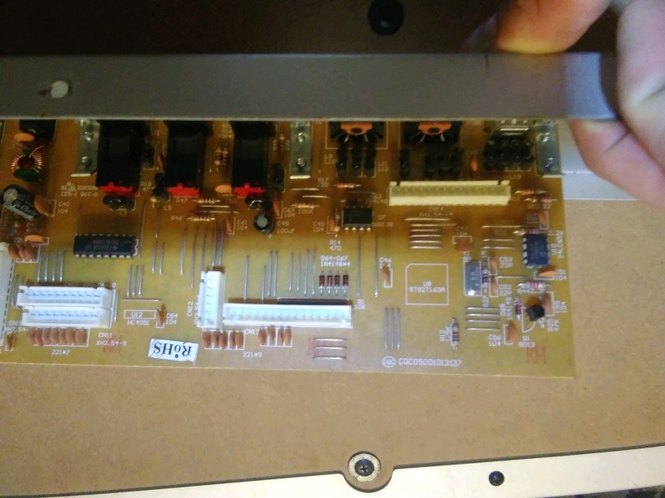
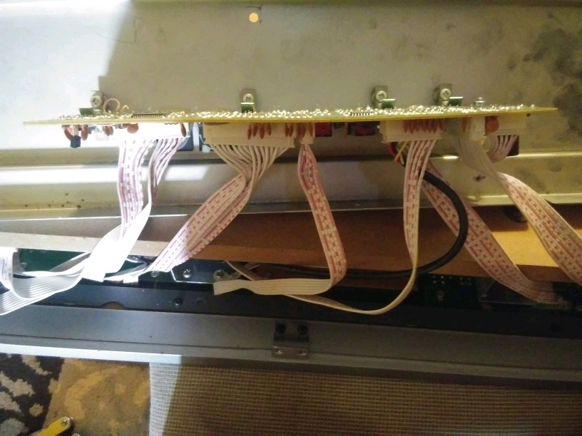
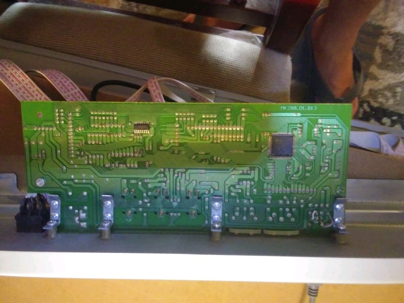
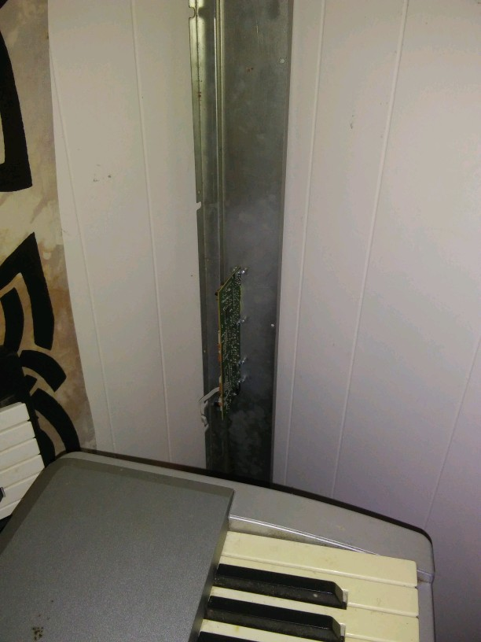
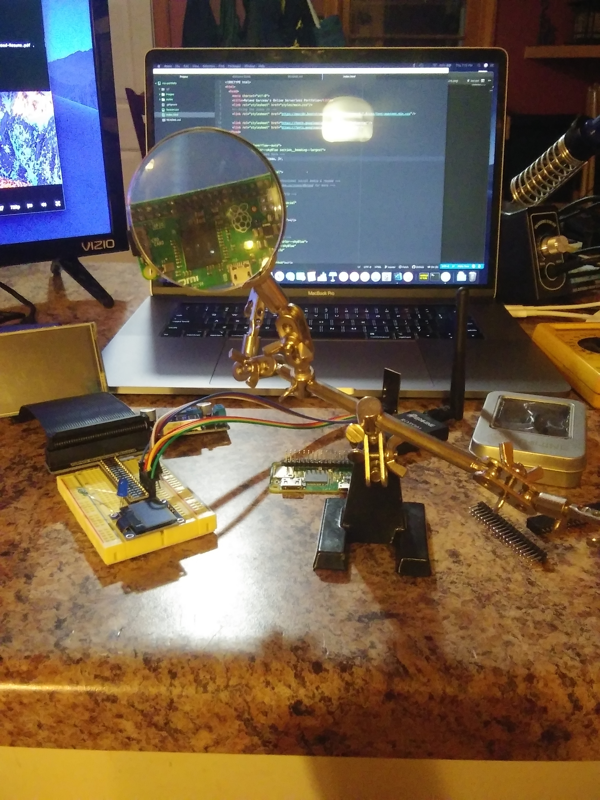
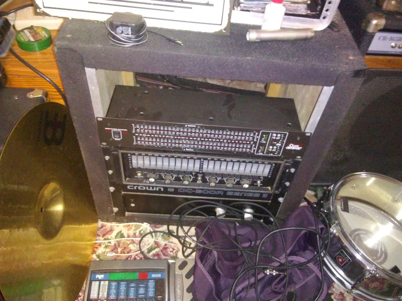

# M-Audio Pro 88 Keystation
The firewire port is what we now use to transfer information, much like the older midi plugs. The problem is the square connector is not made to be beat up much. The keyboard itself weights 40 or more lbs as it has weighted keys, and feels decently close to a real piano for under a couple hundred dollars. We dropped it off the stand a few times, and had to solder the connection and even replace the connector attached to the board. Sadly enough on our last drop, it tore from the board and the replacement part was no longer available from the manufacturer. But, for tyhose of you still with one and want a little affirmation of what you are doing is plausible- here we go.

### Tools:
* Phillips head
* Desoldering iron
* Soldering iron
* flux
* solder

First there are a lot of ribbon cables. The good thing is that they all are specific to location and are different types- but if you are doing the same fix on another similar keyboard make sure you snap a shot of the setup just in case you mind isn't photographic. 

Thre board we want to isolate will be the one that has the 1/4" jacks also attached.

When you first pull the back off you will be limited to range of movement until you get the ribbon cables out of the way. The retention clips are flimsy so don't use big hands and lots of force or you might as well throw it in the trash now.

From the bottom on the bottom right you can see the 6 solder points and jumpers that may need to be addressed here. Obvious signs of wear is blackened edges and possible arcing. We fixed it once with a simple desolder and a resolder of the 4 main connections. It hit the ground and we had to desolder and replace the entire connector the second time around. This will weaken the board the more you apply heat, so be as precise and quick with your gun as you can. Also don't put the heat on the gun to nuclear, keep it as low as you can to melt the solder while still being able to do the work. A good desoldering bulb is in order if you got to remove it- it will heat and suck out the material for you instead of trying to heat all of the leads and start pulling on it thinking you are getting somewhere.

The board may stay attached to the plate if you need to have something to hold it with- I have a magnifying glass and alligator clips to work with. 

That helps us old farts see better...

And if you are a poor musician like me you make your own travel cases out of leftover wood from the last building project you have laying around in the basement.

